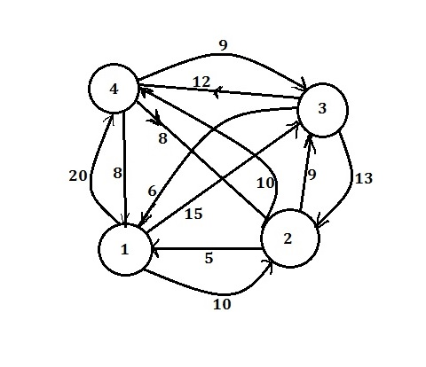

## TRAVELING SALESMAN PROBLEM

Has used dynamic programming approach to solve the problem

#### Execute cpp executor file and provide the inputs for the graph and you'll get the optimal path solution

